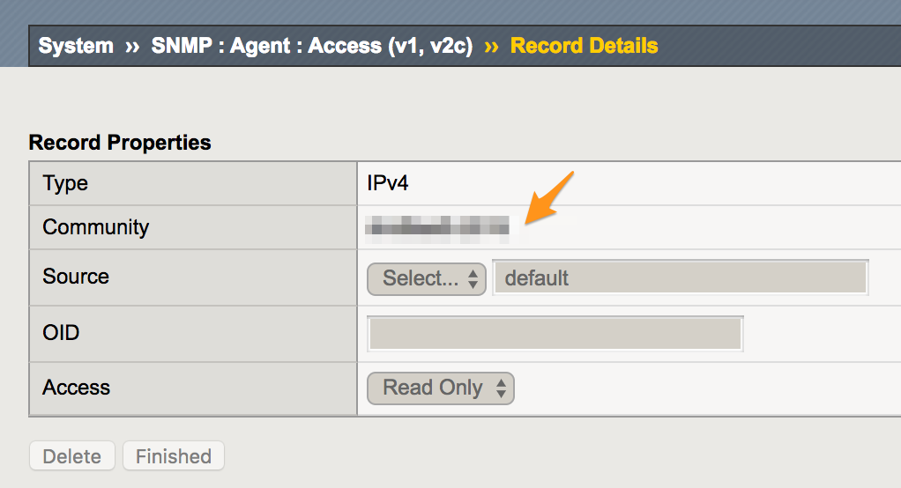
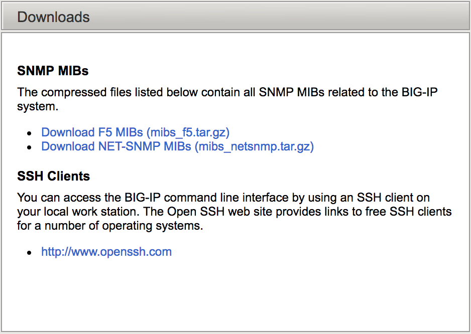

# Zabbix Template - f5
This is a zabbix 3.0 template for f5 statistics.

# Usage
1. setup F5 SNMP configurations as follows  
  
  
2. download and untar `mibs_f5.tar.gz` and `mibs_netsnmp.tar.gz` mibs into your zabbix server. tarballs are avaliable to download in your f5 device webUI (optional)  

3. import zabbix templates and apply to your host
4. check if it works

# References
1. [f5 snmp agent configuration](https://support.f5.com/kb/en-us/products/big-ip_ltm/manuals/product/tmos-implementations-11-1-0/20.html)
2. [f5 network monitoring using snmp](https://support.f5.com/kb/en-us/products/big-ip_ltm/manuals/product/bigip-external-monitoring-implementations-11-3-0/8.html)
3. [oidview - f5](http://www.oidview.com/mibs/3375/md-3375-1.html)

